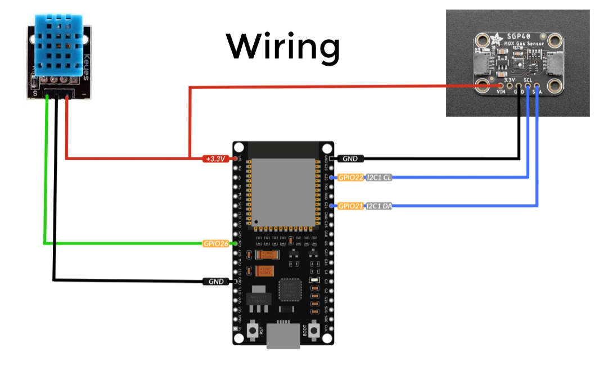
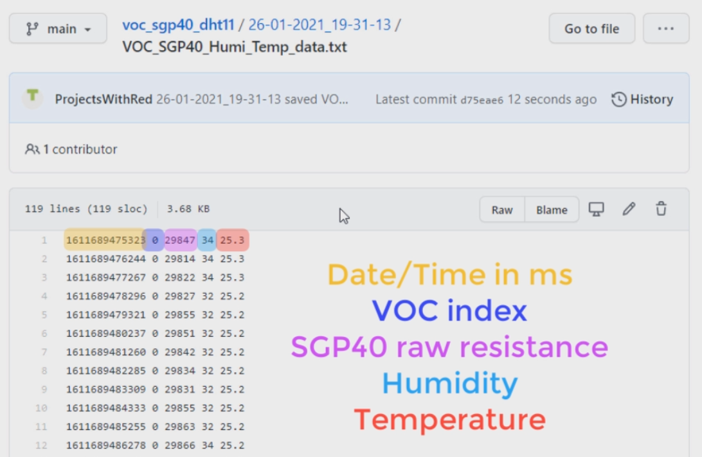

# VOC SGP40 DHT11

Measure the air quality (VOC) using the SGP40 and DHT11 sensors.

# Video

There is a [video](https://youtu.be/iJIebUzhAIM) associated with this repo. Please watch the video, it explains how to use this repo and everything you need to know for the project.

<iframe width="560" height="315" src="https://www.youtube.com/embed/iJIebUzhAIM" frameborder="0" allow="accelerometer; autoplay; clipboard-write; encrypted-media; gyroscope; picture-in-picture" allowfullscreen></iframe>

# Components required

## Micro-controller

For the micro-controller, `ESP32` was used, but the `ESP8266` will work as well.

## Sensors

- `SGP40`, used to "sense" the air quality, it gives the quality of the air in terms of the raw resistance.
- `DHT11`, since the quality of the air changes with the temperature and humidity, this sensor is used to obtain those two measurements.

# Arduino

- For the Arduino sketch, please refer to the `/VOC_SGP40_DHT11` directory.

## Changes you need to make

- `VOC_SGP40_DHT11.ino`, change the WiFi name and password, and also make sure the DHT11 pin matches with your connection.
- `/data/index.html`, change the following:
    - `username: "Your-GitHub-username"`
    - `password: "Your-GitHub-password"`
    - `token: "Your-GitHub-token"` (I go through how to obtain your token in the video)
    - `repo: "Your-GitHub-repo"`

### Optional changes

- In `data/index.html`,
    - `dataRate` rate at which data is obtained from all the sensors in milliseconds. (Default 1000).
    - `save` whether to save/backup sensor data to GitHub. (Default true)
    - `saveRate` rate at which all sensors data points are saved to GitHub in seconds. (Default 120).

## Libraries needed for the Arduino sketch

- Two of which, can be installed directly from the Arduino IDE (Tools>Manage Libraries...):
    - `Adafruit SGP40 Sensor`
    - `DHT sensor library` by Adafruit
- Libraries needed to be installed manually (great tutorial on how to install them can be found [here](https://youtu.be/mkXsmCgvy0k)):
    - [SPIFFS for ESP32](https://github.com/me-no-dev/arduino-esp32fs-plugin/releases/) or [SPIFFS for ESP8266](https://github.com/esp8266/arduino-esp8266fs-plugin/releases/tag/0.2.0)
    - [AsyncTCP](https://github.com/me-no-dev/AsyncTCP)
    - [ESPAsyncWebServer](https://github.com/me-no-dev/ESPAsyncWebServer)

# Wiring diagram

# How to use

- When the micro-controller is turned on, its local IP address will be printed in the serial monitor, navigate to the IP address in a web browser to see the measurements.
- When the data is saved (based on the saveRate you set), it will create a directory, named with the date and time of when the micro-controller was turned on.
- The data will be saved in a text file with each value seperated by a space, where each line is a data point. The values saved (in this order):
    - `Date/Time` in miliseconds.
    - `VOC index`
    - `SGP40 raw resistance`
    - `Humidity`
    - `Temperature`
    - Illustration on how the data is saved:

